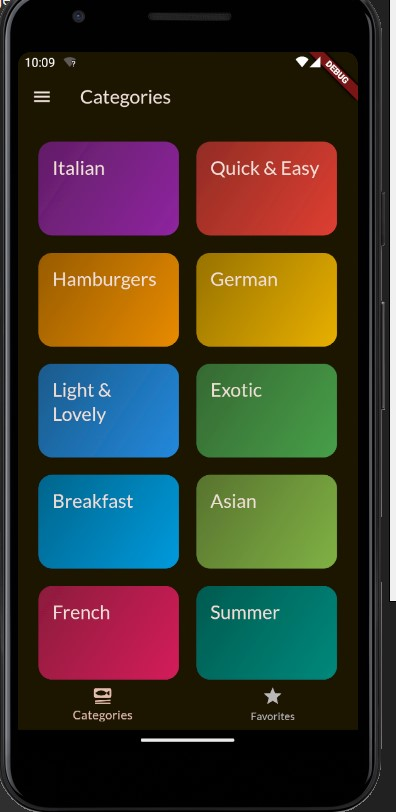

# **Meal App** 🍲

**Meal App** is a Flutter-based mobile application that allows users to browse, filter, select, and favorite meals. With a sleek user interface and easy navigation, this app provides a seamless experience for users looking to explore new recipes. Users can filter meals based on preferences like dietary restrictions, complexity, and more.

This app was inspired by a Flutter course I took on **Udemy**, which helped shape many of the features and the overall structure of the app.

---

## **Features** ✨

- **Home Screen**: Displays a categorized list of meal options such as Italian, Asian, Quick & Easy, etc.
- **Meal Details**: Tap on a meal to view ingredients, preparation steps, and other details like complexity and affordability.
- **Favorite Meals**: Users can favorite meals to easily access them later.
- **Filter Functionality**: Includes a filter bar for dietary preferences like vegetarian, vegan, gluten-free, and lactose-free options. Filters can be applied from the **Settings** (burger menu) at the top left corner.
- **Settings (Burger Menu)**: Provides access to settings where users can configure their filters and app preferences.
- **Responsive UI**: Consistent experience across various screen sizes and orientations.

---
## **Screenshots** 📸
### 1. **Home Screen**
_Screenshot of Home Screen showing meal categories like Italian, Asian, Quick & Easy, etc., along with the burger menu for accessing filters._


---

### 2. **Favorites Screen**
_Screenshot of the Favorites Screen displaying saved meals._


---

### 3. **Meal Details Screen**
_Screenshot of the Meal Details Screen showing ingredients, preparation steps, and dietary filters._


---

### 4. **Filter Bar and Settings**
_Screenshot of the filter bar showing options like vegetarian, vegan, gluten-free, etc., and how it integrates with the burger menu._


---

## **Setup & Installation** ⚙️

To get the project running locally:

1. **Clone the repository**:
   ```bash
   git clone https://github.com/yourusername/meal_app.git
   cd meal_app
   ```

2. **Install dependencies**:
   ```bash
   flutter pub get
   ```

3. **Run the app**:
   ```bash
   flutter run
   ```

---

## **Customization Options** 🛠️

- **Filter Settings**: Modify filters in `filter_screen.dart` to add or remove meal preferences.
- **Themes**: Change the color scheme in `theme.dart` to adjust the look and feel of the app.
- **Favorites**: Update logic for managing favorites in `favorites_screen.dart` and `meal.dart`.

---

## **Future Enhancements** 🔮

- **Backend API Integration**: Implement real-time meal data fetching through a backend service.
- **Search Functionality**: Add a search bar for searching meals by name, ingredients, or other attributes.
- **User Authentication**: Enable users to create accounts and store their favorite meals in the cloud.

---

## **Contributing** 🤝

We welcome contributions! Feel free to fork this repository and submit a pull request. You can also open an issue if you encounter a bug or have a suggestion for improving the app.

---

## **Acknowledgments** 🙏

- Special thanks to the **Udemy Flutter course** that provided inspiration and guidance for the creation of this app.
- Thanks to the Flutter team for the extensive documentation and community support.
- Inspiration for features and UI was drawn from a variety of open-source meal and recipe apps.

For more help with Flutter, you can view the [official documentation](https://docs.flutter.dev/) for tutorials, API references, and more.

